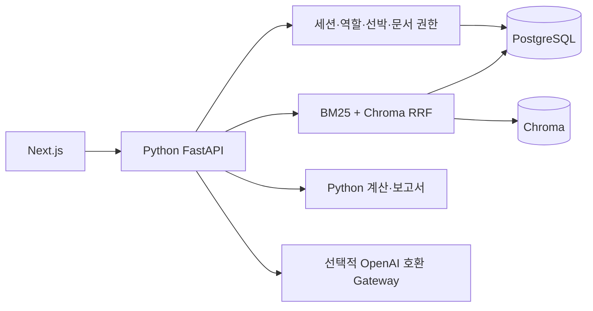

# 캡스톤 설계 대응

최종 업데이트: 2026-09-29. 승인 범위는 설계 기술 스택 전환과 핵심 기능 구현입니다.

## 구조

Next.js는 동일 출처 API를 루프백 Python으로 전달합니다. PostgreSQL이 원본·권한·이력의 기준이고 Chroma는 재생성 가능한 색인입니다. 모델 준비 후 로컬 검색·계산·보고서는 외부 인터넷 없이 실행하도록 구성했습니다.

| 요구 | 구현과 경계 |
|---|---|
| 설계 스택 | Next.js/Python/PostgreSQL/Chroma 기본 실행, Windows 검증 |
| PDF 메타데이터·페이지·조항 | 텍스트 추출과 조항·페이지 청크. OCR/표 셀은 후속 범위 |
| Hybrid RAG | BM25Plus + cosine 벡터의 RRF, 상위 5개, 한영 용어 확장 |
| 개정·폐기 | 논리 ID당 현재 버전 1개, 중복 버전/동시 등록 제약, 이전 근거 보존 |
| 자연어 분기 | 문서/조회/계산/초안, 모델 또는 규칙 경로, 선박·기간 명시 입력 |
| 계산 정합성 | 엄격한 숫자·날짜·범위, Decimal 연산, 원본·버전 포함 |
| 이상 징후·비교 | 인접 기록 연료 2배 초과/절반 미만 표시, 선박 비교. 통계적 탐지 아님 |
| 보고서 | Noon/MRV 검토용 초안, 명시적 저장, 충돌 검출, 스냅샷, MD/JSON |
| 접근 제어 | 3개 역할, 선박 배정, 제한 문서, 보고서 근거 권한 재검사 |
| 운영 | 질의/도구/변경/실패 이력, 세션/CSRF, 백업·빈 DB 복원 |
| 모델 교체 | OpenAI 호환 함수 호출, 실제 추론 미검증 |
| 한영 응답 | 언어 선택·용어 사전. 모델 미설정 시 출처 원문 언어 그대로 표시 |

## 평가와 후속 범위

테스트는 역할 우회, 선박 혼동, 제한 근거 누출, 개정/폐기, 세션 철회, 계산 반복성, 입력 오류, 동시 수정, PDF 페이지, 백업 무결성/복원, 허위 인용 거절을 확인합니다. 모의 HTTP 모델 테스트는 실제 추론 성능을 뜻하지 않습니다.

설계의 Recall@5 ≥ 90%, 인용 정확도 ≥ 95%, 계산 상대오차 ≤ 0.1%, 응답 P95 ≤ 15초, SUS ≥ 70, 완료율 ≥ 90%, 효율 향상 30%, 권한 검증 100%는 **평가 목표**입니다. 개발 테스트 통과를 KPI 달성으로 해석하지 않습니다. 정답 세트·실선 자료·사용자 평가와 로그 기반 측정이 필요합니다.

후속: 다국어 임베딩 평가, OCR·표 구조, 원본 PDF 저장/미리보기, 공식 연간 CII 기준선·보정·제외 항차와 MRV 서식, 비밀번호 재설정 UI, 본격 스키마 마이그레이션, 대규모 작업 큐, 운영 HTTPS·백업 정책. 현재는 루프백 단일 개발 환경입니다.

2026-09-30 해사 데이터 후속 작업에서 실제 MRV 80,552행과 합성 Noon 4,380행의 원본을 검증하고 별도 전처리 산출물·6개 테이블 데이터 계약·ERD를 작성했습니다. 기존 19개 테이블 정의서 전체를 대체하지 않으며, 시제품 DB에 적재하거나 화면에 연결하지 않았습니다. 상세 결과는 [해사 데이터 검증](maritime-data/VALIDATION.md)을 참고하세요.
