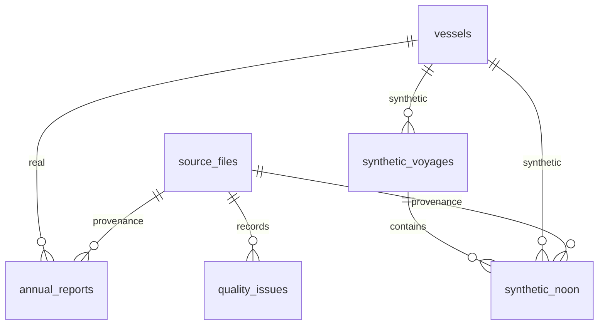

# 해사 데이터 계약 v1

2026-09-30. 원본 컬럼을 확인한 구현 기준안입니다. 기존 전사 19개 테이블 정의서를 대체하지 않습니다. 공식 계수·항구 매핑·실제 DWT 보강은 미확정입니다. 로컬 DB 적재 결과는 `docs/maritime-data/DB_LOAD_RESULT.md`, 조회 Tool 계약은 `docs/maritime-data/QUERY_TOOL.md`를 확인하세요.

## 용도와 경계

- DS-001/005: 실제 보고기간 집계 조회. 연간 자료를 일별·항차별로 분해하지 않습니다.
- DS-006: 개발용으로 선정. 가상 표식을 유지한 채 일별 조회·항차 집계·Tool 테스트에 사용합니다.
- DS-003: 항구 기준정보로 보존. 항구명만 보고 자동 조인하지 않습니다.
- DS-004: 컬럼 설계 참고. 운항 관측 데이터에 포함하지 않습니다.
- DS-002: 마스킹 AIS 참고. 좌표 스케일을 추정 변환하거나 실제 선박과 연결하지 않습니다.

## 키·결측·중복 정책

- 실제 선박 키 `REAL:IMO:번호`, 가상 선박 키 `SYN:원본ID`로 충돌을 방지합니다. 실제 IMO 형식·체크섬을 검사하고 발급 여부는 검증하지 않습니다.
- 원본 파일 SHA256, 시트, 행으로 출처를 추적합니다. CSV 행 번호는 줄바꿈을 포함하는 물리 행이 아닌 논리 레코드 번호입니다.
- `raw_records.jsonl`은 모든 원본 관측 레코드와 안정적인 record_id를 보존합니다. XLSX 중복 헤더는 순서 배열로 보존합니다.
- 빈칸·N/A·원본 나눗셈 오류·음수·비정상 숫자를 구분합니다. 빈 CSV 셀은 DB NULL이며 0은 실제 원본 0입니다.
- 역사 MRV 운항시간은 명시적 원본 별칭을 확인합니다. 별칭 간 값이 다르면 선택하지 않고 결측·충돌로 남깁니다.
- 역산 거리는 추정치이며 원본 총량과 거리당 지표의 범위 일치가 검증되지 않았습니다. 공식 계산이나 독립 검증의 정답으로 사용하지 않습니다.
- Partial 보고서는 원본별 보존하고 Full과 합산하지 않습니다. 선박·연도·보고유형 중복의 모든 행을 REVIEW로 처리합니다.
- 가상 항차 첫/마지막 보고일을 실제 입출항 시각으로 바꾸지 않습니다. 2025 첫 Noon 구간은 2024-12-31에 시작할 수 있습니다.
- VALID는 지정 전처리 규칙 통과일 뿐 원본 사실성·규정 적합성의 인증이 아닙니다. REVIEW/REJECT는 기본 집계에서 제외합니다.

## ERD

`quality_issues.record_id`는 연간/일별 레코드 중 하나를 가리키는 논리 참조입니다. SQL의 외래키는 source_id에만 적용합니다. 원본 조회는 record_id 및 출처 키로 수행합니다.

## 컬럼 정의

### source_files — 원본 파일·출처

| 컬럼 | PostgreSQL 타입 | 제약 | 의미·단위 |
|---|---|---|---|
| source_id | text | PK | Dataset ID + SHA256 |
| dataset_id | text | required | DS-001..006 |
| filename | text | required | Original basename |
| sha256 | text | required | Original byte checksum |
| source_url | text | nullable | Source recorded in assessment; not license approval |
| data_origin | text | required | REAL / SYNTHETIC / REFERENCE / SCHEMA |
| granularity | text | required | report / daily / position / port / schema |
| selection | text | required | Selected use for this preparation |
| row_count | integer | required | Count read from original |
| header_json | jsonb | required | Original ordered headers; duplicate XLSX names preserved |

### vessels — 실제·합성 선박 식별

| 컬럼 | PostgreSQL 타입 | 제약 | 의미·단위 |
|---|---|---|---|
| vessel_id | text | PK | REAL:IMO:<number> or SYN:<source vessel ID> |
| data_origin | text | required | REAL or SYNTHETIC; never joined across origins |
| imo_number | text | nullable | Seven-digit source IMO; synthetic remains NULL |
| source_vessel_id | text | required | Original IMO or synthetic vessel ID |

### annual_reports — 실제 MRV 보고기간 집계

| 컬럼 | PostgreSQL 타입 | 제약 | 의미·단위 |
|---|---|---|---|
| record_id | text | PK | Stable source/sheet/row hash |
| source_id | text | FK source_files | Source version |
| source_sheet | text | required | CSV or original XLSX sheet |
| source_row | integer | required | Original row number; CSV is logical record number |
| vessel_id | text | FK vessels | Real vessel only |
| vessel_name | text | nullable | Name at reporting time |
| ship_type | text | nullable | Source classification, unmodified |
| reporting_year | integer | required | Reporting year |
| report_type | text | required | FULL / PARTIAL / ARCHIVE_ANNUAL |
| period_label | text | required | Original reporting period |
| period_start | date | nullable | Reported partial bounds or nominal annual boundary; not observation date |
| period_end | date | nullable | Reported partial bounds or nominal annual boundary |
| fuel_t | numeric | nullable | Source total fuel, tonnes; no fuel split invented |
| co2_t | numeric | nullable | Reported CO2 tonnes; not CO2-equivalent |
| sea_hours | numeric | nullable | Reported sea hours, aliases checked for agreement |
| fuel_kg_per_nm | numeric | nullable | Reported distance intensity |
| distance_nm_estimate | numeric | nullable | fuel_t * 1000 / intensity; scope not verified |
| dwt_t | numeric | nullable | Source value only; missing stays NULL |
| fuel_type | text | nullable | Not provided in MRV inputs |
| quality_status | text | required | VALID / REVIEW / REJECT |
| aggregate_eligible | boolean | required | False for partial, duplicate keys, invalid core numbers |
| provenance_json | jsonb | required | Per-field original columns, missing reasons, distance method |

### synthetic_noon — 개발용 합성 일별 기록

| 컬럼 | PostgreSQL 타입 | 제약 | 의미·단위 |
|---|---|---|---|
| record_id | text | PK | Stable source/row hash |
| source_id | text | FK source_files | Source version |
| source_row | integer | required | Original CSV logical row |
| vessel_id | text | FK vessels | Synthetic vessel only |
| voyage_id | text | FK synthetic_voyages | Synthetic voyage key |
| report_date | date | required | Noon reporting date; observation period may straddle years |
| period_start_utc | timestamptz | required | Original interval start UTC |
| observed_at_utc | timestamptz | required | Original interval end UTC |
| vessel_name | text | required | Fictional source name |
| ship_type | text | required | Fictional source type |
| dwt_t | numeric | required | Fictional DWT tonnes |
| operating_status | text | required | Source SEA/PORT classification |
| distance_nm | numeric | required | Fictional daily distance; zero in port allowed |
| fuel_t | numeric | required | Fictional daily fuel tonnes |
| fuel_type | text | required | Source fuel label; not an official factor mapping |
| speed_kn | numeric | required | Fictional speed |
| engine_hours | numeric | required | 0..24 hours |
| quality_status | text | required | VALID / REVIEW / REJECT |
| provenance_json | jsonb | required | Simulation flags/version/seed and original missing reasons |

### synthetic_voyages — 개발용 합성 항차

| 컬럼 | PostgreSQL 타입 | 제약 | 의미·단위 |
|---|---|---|---|
| voyage_id | text | PK | SYN:<source voyage ID> |
| vessel_id | text | FK vessels | Synthetic vessel |
| departure_port_label | text | nullable | Source label; no unverified WPI match |
| arrival_port_label | text | nullable | Source label; no unverified WPI match |
| first_report_date | date | required | First included report date, NOT departure time |
| last_report_date | date | required | Last included report date, NOT arrival time |
| mapping_status | text | required | UNMAPPED_PORT_LABELS / CONFLICT |

### quality_issues — 전처리 품질 이슈

| 컬럼 | PostgreSQL 타입 | 제약 | 의미·단위 |
|---|---|---|---|
| issue_id | integer | PK | Sequence within deterministic run |
| record_id | text | nullable | Logical reference to annual/noon row |
| source_id | text | FK source_files | Input source version |
| source_row | integer | required | Original record row |
| severity | text | required | INFO / REVIEW / REJECT |
| field | text | required | Affected field |
| code | text | required | Machine-readable issue code |
| detail | text | required | Evidence without replacing original value |

## 적재 전 확인

DDL은 별도 `maritime_data` 스키마에만 새 테이블을 생성하도록 작성했습니다. DDL 생성만으로 CSV를 적재하지는 않습니다. 기존 앱 화면·Agent는 이를 자동 조회하지 않습니다. 관리자 조회 API 계약과 적재 결과는 별도 문서를 확인하세요.
정상·검토 레코드와 거절 레코드의 적재 경로를 나누고 필수값이 없는 REJECT는 원본/이슈 저장소에만 보관하세요. INSERT 시 숫자·날짜를 파싱하고 JSON 필드는 JSONB로 적재합니다. 원본 판정 충족률을 공식 CII 준비율로 사용하지 않습니다.
